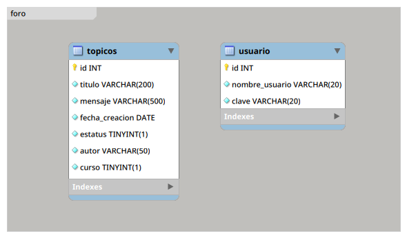
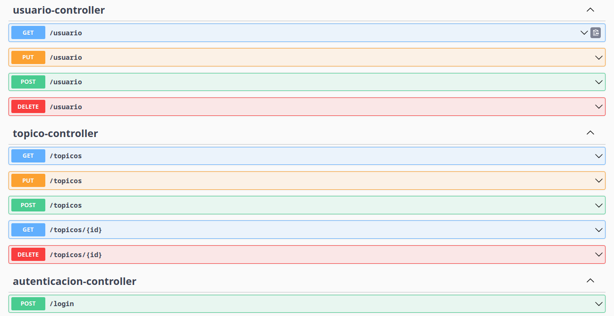
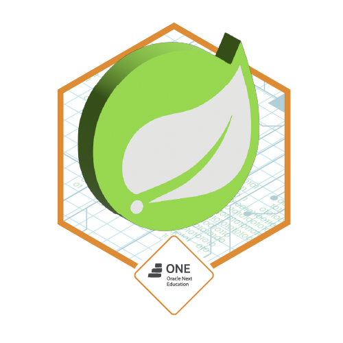

# FORO CHALLENGE

## Descripción
Proyecto realizado para completar el desafió de Alura.

## Perfiles

| Perfiles | Descripción |
|---|---|
| prod | producción |
| dev | desarrolllo |

##### Lanzamiento a producción
```sh
java -DMYSQL_URL=jdbc:mysql://domain:port/forochallenge -DMYSQL_USER=test -DMYSQL_PASS=test -jar api-0.0.1-SNAPSHOT.jar --spring.profiles.active=prod
```

## Test Realizados


## Test Unitario|Integración
```js
[INFO] Tests run: 1, Failures: 0, Errors: 0, Skipped: 0, Time elapsed: 1.695 s - in com.foro.api.repository.TopicosRepositoryTest
[INFO] 
[INFO] Results:
[INFO] 
[INFO] Tests run: 3, Failures: 0, Errors: 0, Skipped: 0
[INFO] 
[INFO] ------------------------------------------------------------------------
[INFO] BUILD SUCCESS
[INFO] ------------------------------------------------------------------------
[INFO] Total time:  17.814 s
[INFO] Finished at: 2023-09-28T21:48:15-03:00
[INFO] ------------------------------------------------------------------------
```

## Diagrama Entidad Relación [EER]


## Documentación [Swagger-UI]


## Insignia [Alura Challenge]


## Construido con 🛠️
* Java 17

## Autor ✒️
* **Usui, José Fernando** - *Desarrollo de la API*

## Contacto 📱
* Gmail: _joesesilvae@gmail.com_
